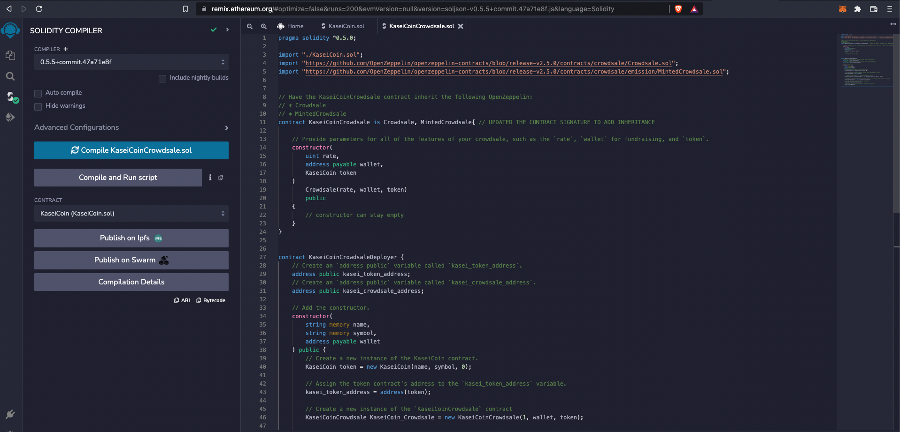

# Unit 21: Martian Token Crowdsale

## Background

After waiting for years and passing several tests, the Martian Aerospace Agency selected you to become part of the first human colony on Mars. As a prominent fintech professional, they chose you to lead a project developing a monetary system for the new Mars colony. You decided to base this new system on blockchain technology and to define a new cryptocurrency named **KaseiCoin**. (Kasei means Mars in Japanese.)

KaseiCoin will be a fungible token that’s ERC-20 compliant. You’ll launch a crowdsale that will allow people who are moving to Mars to convert their earthling money to KaseiCoin.

## Files

Worked on Remix and completed:

[KaseiCoin.sol](Starter_Code/KaseiCoin.sol)

[KaseiCoinCrowdsale.sol](Starter_Code/KaseiCoinCrowdsale.sol)

[KaseiCoinCrowdsale_OPTIONAL.sol](Starter_Code/KaseiCoinCrowdsale_OPTIONAL.sol)

## Project Context

I will be creating a fungible token named KaseiCoin that is ERC-20 compliant. The purpose of this coin is to be used in MARS by the first Martians!

**The steps for this Project are divided into the following subsections:**

1. Creating the KaseiCoin Token Contract

2. Creating the KaseiCoin Crowdsale Contract

3. Creating the KaseiCoin Deployer Contract

4. Deploying and Test the Crowdsale on a Local Blockchain

5. Optional: Extending the Crowdsale Contract by Using OpenZeppelin

> **Note:** 